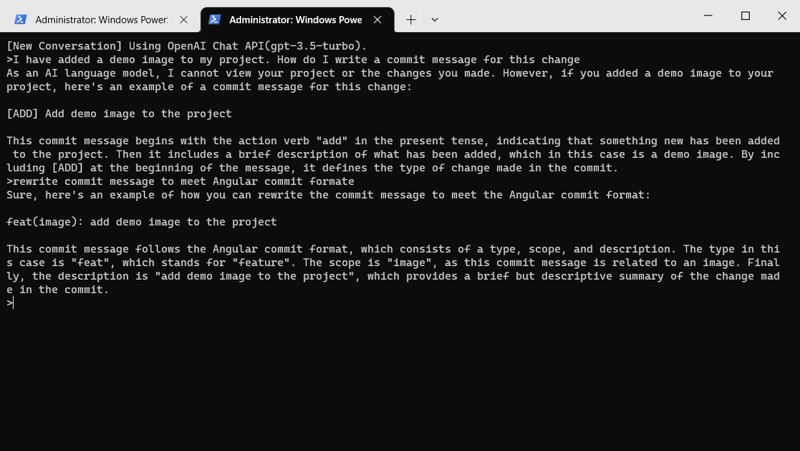

# ConsoleChat

Use the OpenAI API to interact with ChatGPT on the console

[](./demo.png)
### Installation

Clone the repository:   
```
git clone https://github.com/milu65/console_chat.git
```
Navigate to the directory:   
```
cd console_chat
```
Install the required libraries:  
```
pip install -r requirements.txt  
```

### Configuration
Create file config.json in the current directory.
#### Template: config.json
```json
{
  "api_key": "00000000000000000000000000000000000000000000000",
  "model": "gpt-4",
  "is_stream": true,
  "enable_conversation_log": true
}
```

### Usage
Run the program:  
```
python console_chat.py [option]
```
The following options are available:
- history: prints the file path where the conversation log is saved and exits.
- gpt3: specifies the GPT model to be used as "gpt-3.5-turbo". If not specified, the default model specified in the config file will be used.
- gpt4: specifies the GPT model to be used as "gpt-4". If not specified, the default model specified in the config file will be used.

When the program is run, it will prompt the user for input. To exit the chatbot, the user can type "q" and press enter. To clear the conversation history, the user can type "clear" and press enter.

If the user types "m" and presses enter, the chatbot will switch to multi-line input mode. In this mode, the user can input multiple lines of text. To end multi-line input mode, the user should type "~" on a new line and press enter.

The conversation log is saved in a JSON file specified in the config file. If conversation logging is enabled, the log will be saved when the user types "q" or "clear".

Note: The console_chat requires an OpenAI API key to function. The API key should be stored in the config file specified in the script.